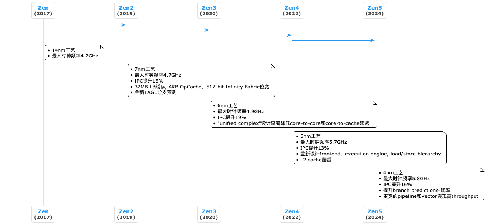
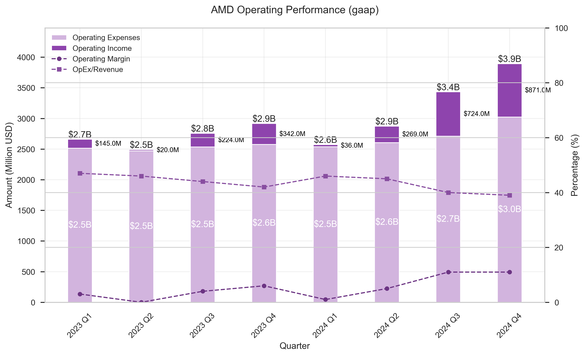

# 成长史

## 技术突破

## 市场突破

* **数据中心市场**： EPYC服务器处理器从32核快速迭代到96核，在云计算和企业级市场获得广泛采用
* **客户端市场**：Ryzen处理器在桌面和笔记本市场持续扩大份额，通过"AMD Advantage"平台概念，联合OEM推出全AMD笔记本
* **游戏市场**：Radeon显卡持续提升性能和能效，为索尼PS5和微软Xbox提供定制APU

## 战略并购

* **Xilinx收购**：2022年完成收购，获得FPGA和自适应SoC技术，使AMD成为唯一同时拥有高性能CPU、GPU和FPGA的厂商
* **Pensando收购**：获得DPU技术，加强数据中心网络处理能力，完善了从CPU到GPU再到网络DPU的一体化平台

# 产品线和业务线

## 技术基础层

CPU与核心架构:

- **Zen系列**: AMD的核心CPU架构，从2017年推出至今已迭代至Zen5，用于Ryzen桌面/移动处理器、EPYC服务器处理器、Threadripper工作站处理器

GPU图形与计算架构:

- **RDNA架构**: 面向游戏图形的架构，现已发展到RDNA3，具备硬件光线追踪支持，用于Radeon RX系列显卡
- **CDNA架构**: 面向数据中心GPU计算的架构，强化矩阵计算能力和高带宽缓存，支持多种AI数据格式（INT8/FP8/BF16/TF32等）

FPGA与自适应SoC:

- **Versal系列**: 自适应计算加速平台（ACAP），可编程逻辑FPGA，专用AI引擎，DSP单元，嵌入式CPU核心，用于5G通信、网络、安全和AI推理

## 产品系列层

处理器产品线:

- **Ryzen系列**: 面向个人电脑的CPU产品，包含桌面端：Ryzen 5/7/9系列，移动端：Ryzen Mobile处理器，工作站端：Threadripper系列
- **EPYC系列**: 面向数据中心的服务器CPU，旗舰EPYC 9965包含多达192核心，384线程，针对云原生工作负载优化

图形产品线:

- **Radeon系列**: 消费级和专业图形产品，桌面独立显卡，工作站显卡，游戏主机定制SoC
- **Instinct系列**: 数据中心GPU加速器，用于AI训练和推理，支持高性能计算(HPC)，大容量HBM显存

自适应计算产品线:

- **Versal系列**: 高端自适应计算产品，可用于AI推理与边缘计算

## 业务板块层

数据中心业务:

- 服务器CPU（EPYC）+ 数据中心GPU（Instinct）+ DPUs、Adaptive SoC、FPGA
- 大规模计算、存储、AI
- CPU+GPU协同工作，Infinity Fabric高速互联

客户端业务:

- Ryzen处理器集成Radeon显卡SoC
- 台式机、笔记本
- 全AMD平台优化，统一驱动和调度

游戏业务:

- Radeon独立显卡，PS5/Xbox半定制游戏主机芯片
- PC游戏、游戏主机
- 高performance per watt，FSR光追支持

嵌入式业务:

- FPGA + Adaptive SoC + 嵌入式处理器
- 汽车电子、工业控制、医疗设备、航空航天
- 可编程性、低功耗、高可靠性

# 招股书分析

## 交易概述

AMD收购Xilinx，采用全股票交易结构，每股Xilinx普通股将换取1.7234股AMD普通股。AMD将为此次并购发行约4.236亿股股票。原Xilinx股东将持有合并后AMD约25.9%的股份，远AMD股东持有约74.1%。交易签署前12个月合并收入约116亿美元，新公司有望在合并完成后的18个月内实现3亿美元的协同效益，管理层预期将总可寻址市场(TAM)扩大至1100亿美元。

## 战略意义分析

* **产品组合优化**：AMD专注高性能计算领域，产品涵盖x86处理器(CPU)和图形处理器(GPU)。Xilinx是FPGA和自适应SoC领域的领先企业。整合形成业内最完整的高性能处理器产品线。
* **市场拓展**：强化现有市场：AMD：个人计算、游戏、数据中心；Xilinx：通信基础设施、工业、汽车、航空航天、国防等垂直领域 + 开拓新兴领域：云计算、人工智能、智能网络、边缘计算
* **技术协同**：CPU + GPU + FPGA + SmartNIC -> SoC

## 财务影响分析

* **盈利能力**：提升毛利水平（受益于Xilinx高附加值产品），改善运营效率，提高每股收益
* **收入多元化**：收入多元化，降低单一市场依赖程度，扩大市场覆盖范围
* **财务稳健性**：全股票交易，无新增债务负担，现金储备充足，提升信用评级潜力，增强投资和抵御周期波动能力

# 财报分析

### 营业收入

营业收入构成图展示了AMD总营业收入的核心组成部分：销售成本（COGS）和毛利。图表中包含了毛利率走势线（以百分比表示），同时展示GAAP和非GAAP指标，用于追踪盈利能力趋势。

- 毛利率保持在45%-50%的稳定区间
- 营业收入规模呈现季度波动，整体维持在50-70亿美元区间，近两个季度显著增长

### 运营表现

运营表现图展示了AMD的运营效率，通过对比运营收入和运营费用的关系，跟踪两个关键百分比指标：运营利润率和运营费用占营业收入比，反映了公司的运营效率和成本管理能力。

- 运营利润率呈现在周期波动的基础上呈现上升趋势，并在最近两个季度突破10%
- 运营费用占营业收入比率保持在GAAP 40% (NON-GAAP 30%)左右的水平

### 股东回报

股东回报分析图通过双轴展示了AMD的最终经营成果：归属于普通股股东的净利润（柱状图，左轴）和每股收益（柱状图，右轴）。GAAP和非GAAP版本的对比为投资者提供了不同维度的业绩评估视角。

- 净利润和每股收益具备非常显著的周期性
- 近两个季度的增长体现在了NON-GAAP当中，但并未体现于GAAP

### 业务板块

业务板块分析图展示了AMD各主要业务板块的表现，包括数据中心、客户端、游戏和嵌入式。图表包含各板块的营业收入贡献、运营利润分布和利润率。

- 相比于最初的游戏板块，数据中心板块逐渐成为公司最大营业收入来源，占比接近60%
- 数据中心板块和游戏板块在周期性变动的过程当中持续增长
- 游戏板块持续萎缩，并在2024年显著下降；嵌入式板块同样收缩明显，但在最近两个季度有所回升

这种分部视图有助于理解各业务单元的相对实力和盈利能力。

# 附录

## 技术资料

- CPU Benchmark: [PassMark](https://www.cpubenchmark.net/high_end_cpus.html)

## 招股说明书

- AMD最新招股书修订版（Form 424B3）：[SEC EDGAR](https://www.sec.gov/Archives/edgar/data/2488/000119312521071625/d83168d424b3.htm)

## 季度财报

- AMD投资者关系网站: [AMD Investor Relations](https://ir.amd.com/)
- AMD财报：[AMD Financial Results](https://ir.amd.com/financial-information/financial-results)
