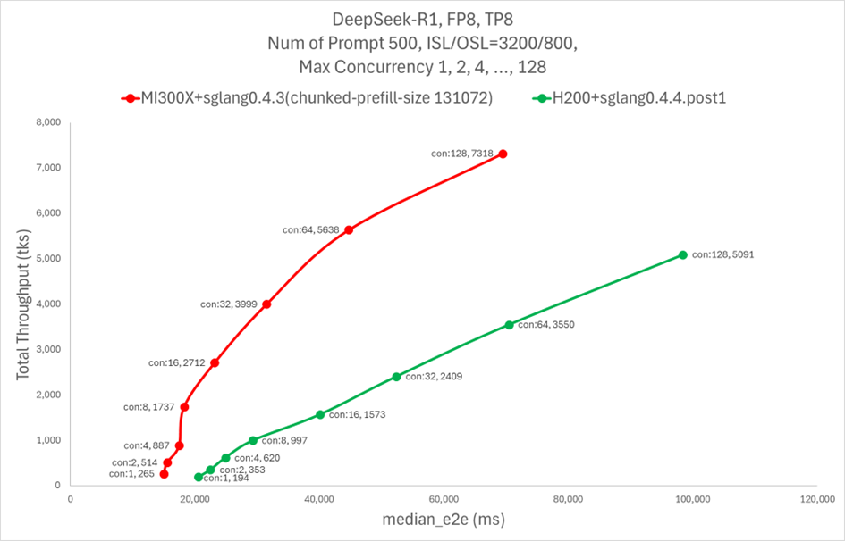
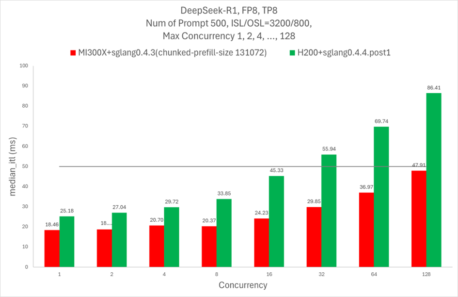

# AI推理GPU-GPU通信需求的降低或将掩盖AMD多卡互联能力的不足

- Nvidia的NVLink和NVSwitch主要解决的是GPU-GPU通信，相比PCIe 6.0的128GB/s (x16 lanes)，NVSwitch (5th-Gen)可实现1.8TB/s带宽

<em>Figure 1: NVLink/NVSwitch architecture</em>

- AMD在单卡性能上和Nvidia不存在明显差距，甚至在某些方面领先Nvidia

Instinct MI300X部署Deepseek R1优化推理（[Supercharge Deepseek-R1 Inference on AMD Instinct MI300X](https://rocm.blogs.amd.com/artificial-intelligence/DeepSeekR1-Part2/README.html)）

    - 通过使用最新的SGLang框架，得益于MI300X更大的显存容量（192GB HBM3，5.3TB/s内存带宽，1307.4 TFLOPS FP16峰值算力），与Nvidia H200（141GB HBM3E，4.8TB/s内存带宽）相比，MI300X实现了在相同latency下throughput提高2到5倍，在相同concurrency下throughput提高75%，latency降低60%

    - 针对ROCm软件(AITER)内核的AI Tensor Engine经过优化，提供+2X GEMM（通用矩阵乘法）, +3X MoE（混合专家架构）, +17X MLA（多头潜在注意力）解码，+14X MHA prefilling

<em>Figure 2: AMD MI300X vs. NVIDIA H200</em>

AMD MI300X和Nvidia H200性能对比：

| 规格             | AMD MI300X                 | NVIDIA H200                 |
| ---------------- | -------------------------- | --------------------------- |
| 显存容量         | 192GB HBM3                 | 141GB HBM3E                 |
| 内存带宽         | 5.3 TB/s                   | 4.8 TB/s                    |
| 峰值算力（FP16） | 1307.4 TFlops              | 989.5 TFlops                |
| 互联技术         | Infinity Fabric (128 GB/s) | NVLink + NVSwitch (900GB/s) |
| 价格             | 20,000 USD                 | 30,000 USD                  |

*该价格只是用作参考的普遍范围，和实际采购价格有所出入，例如有消息称Meta采购MI300X的单价仅为H100（还不是H200）的40%
*Nvidia在GTC大会上发布了新一代GB300和NVL72，但是目前还没有面向市场，后续上市后关注其性能表现；AMD计划推出MI350X，具备288GB HBM3E显存

- AI推理相比训练，GPU-GPU间的通信需求显著减少

  - 数据并行（每个GPU处理不同数据子集）：训练阶段需要反向传播和参数更新，GPU-GPU间需频繁同步梯度（通过例如AllReduce的方法，将局部梯度同步为全局梯度）；而推理阶段仅执行前向传播，没有梯度同步的需求

<em>Figure 3: Pytorch DDP Architecture</em>

  - 模型并行（拆分模型各层到不同GPU）：训练阶段大量使用模型并行，导致巨大的层间张量传输需求（如Megatron-LM架构）；推理阶段主要采用数据并行，仅当模型过大超过显存容量时采用模型并行，才需要少量GPU-GPU层间通信

<em>Figure 4: Tensor Parallelism & Pipeline Parallelism</em>

  - 请求并行（将大模型请求拆分为多个微服务，如预处理->推理->后处理）：训练阶段请求统一（输入数据经预处理后结构统一，各个batch内样本独立同分布），资源分配刚性，无需请求并行；推理阶段，输入的异构性（不同长度的prompt、多模态输入）以及流量和负载波动，更适合使用CPU动态弹性分配资源，而非使用多GPU物理拆分请求

<em>Figure 5: Microservice Architecture for AI reference</em>

- AMD联合微软、Meta、博通等公司成立UALink联盟，建立对标NVLink的开放、统一的GPU互联标准，有望将Infinity Fabric扩展至多GPU集群

# 本地大模型为AMD带来新的机遇

模型精简技术和显存容量提升的"双向奔赴"，让本地大模型称为可能，可能进一步减少多卡协同的通信需求

- 模型精简：

<em>Figure 6: MoE Layer</em>

  - MoE通过动态激活专家子网，减少80%计算量的同时保持性能；
  - 将FP32精度压缩至INT4，结合知识蒸馏技术，模型体积缩减4倍，推理速度提升3倍；
  - sparse-attention显著降低显存占用
- 本地大模型的潜在优势：

  - 工业质检、自动驾驶等场景latency sensitive，云端大模型的网络延迟将成为瓶颈；
  - 敏感数据本地化，模型定制化，金融医疗等行业；利于实现模型和本地工具的无缝衔接：
  - MCP连接数据库和文件系统
- AMD在大显存和异构SoC的优势，或有助于其在AI推理本地化、边缘化的浪潮中占有一席之地

AI PC：AMD RYZEN AI MAX+ 395将CPU和GPU集成到同一SoC，可以把内存当显存，显著提升显存容量，适合在本地部署大模型；可本地部署70B大模型(甚至目前有本地部署236B大模型的尝试)

<em>Figure 7: Unified Memory ROCm</em>

配置信息：

- **CPU**: Strix Halo ZEN5; 16 cores 32 threads; 5.1GHz 80MB cache
- **GPU**: Radeon 8060S **on-board graphics**; 40CU; 游戏性能持平RTX 4060S；功耗几乎减半
- **Memory**: 256-bit LPDDR5x 128 GB，可与on-board GPU共享

性能对比：DeepSeek R1 Distill Llama 70B Q4-K-M

- 幻X 2025: 2.97 tokens/s; 64GB LPDDR5X 8000MHz共享显存
- RTX 5090D: 1.08 tokens/s; 32GB GDDR7 512bit

# 开源开放或许能成为AMD生态的破局之道

Pros:

- AI大模型进入下半场，架构趋同（Transformer架构成为主流范式），减少了对定制化算子的需求；数据中心的需求可以让AI硬件的发展完全摆脱游戏产业；ROCm想要在短期内追赶CUDA，可以聚焦于AI加速，摆脱游戏/HPC的沉重历史包袱，并集中精力优化主流大模型（GPT、Deepseek、Llama、Claude）的推理性能，覆盖少量核心算子即可满足80%以上的应用场景。
- ROCm的开源特性使其成为Meta、微软等大厂构建私有AI栈的基础，避免被CUDA生态绑定
- UALink作为开放协议，不仅能降低厂商接入门槛（例如降低授权费用，DGX一体机采购成本），同时能为其他网络厂商（例如博通、思科）切入AI硬件市场创造机会

Cons:

- AMD的软件平台ROCm在当前确实难以抗衡英伟达的CUDA，UALink也仅仅停留在概念阶段，而英伟达的NVLink/NVSwitch早在2014年就已推出，已经非常成熟
- 同时开源和开放协议也为跨平台优化提出挑战，很可能受制于兼容性的要求而难以充分释放硬件性能

*AMD收购服务器厂商ZT System([AMD completes Acquisition of ZT Systems](https://www.amd.com/en/newsroom/press-releases/2025-3-31-amd-completes-acquisition-of-zt-systems.html)): 2025年3月31日；专注定制化服务器和数据中心解决方案；云计算、边缘计算、HPC
